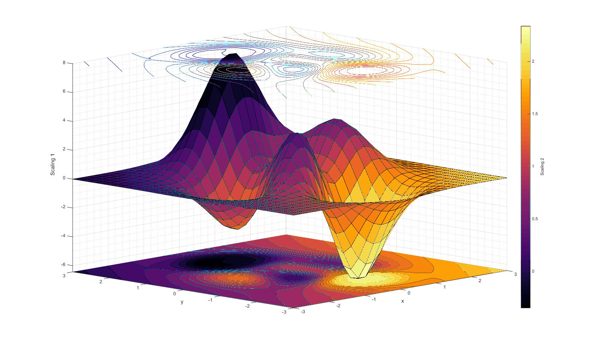

# fixthejet

Information is *not* knowledge. 

Information can be transformed into knowledge by consuming it in a way to understand patterns. One of the primary ways to consume large quantities of information is through pictures: charts, plots, maps that convey the message. Before, 2015, many such figures were inadvertantly prepared using a color scheme called _jet_ that is visually stimulating due to the abundance of colors. Unfortunately, we have come to know of the harm it causes only recently. The _jet_ is not [perceptually uniform](https://programmingdesignsystems.com/color/perceptually-uniform-color-spaces/) which is a fancy way of saying what you see is not what you get. The colormap is known to create artificial gradients in perceptibility which can mislead interpretations of figures. It is also extremely unfriendly to people with colorblindness. For more information check out the [presentation](https://www.youtube.com/watch?v=xAoljeRJ3lU) of launch of the new default colormaps in _matpltolib_. 

This script allows you to change an image (.jpg/.png) file made with _jet_ colormap to any other colormap of your choice. The script selectively changes _jet_ colors only. All others colors in the image remain unchanged (including background and text). 

Be cautious, as pixel blending artefacts from rescaling input images can cause the lines that define the axes of both the plot and the color scale bar to appear oddly.

## Installation

Type the following in terminal or command line. 

`git clone https://github.com/pgrimes/fixthejet.git`

`cd fixthejet`

`pip install .`

The installer adds a command line tool to your current Python environment, that should appear in your path.

## Running

`python fixthejet.py --input <input file> --output <output file>`

or one of (depending on your OS)

`fixthejet.exe --input <input file> --output <output file>`
`fixthejet --input <input file> --output <output file>`

Use `--cmap_out <output colormap>` to control colormap of output file. Default is _viridis_. Only Matplotlib colormaps supported. 

Use `--cmap_in <input colormap>` to control colormap of input file. Default is _jet_. Only Matplotlib colormaps supported. 

_alternatively_

Use `--cbar_extent <left> <right> <top> <bottom>` to have `fixthejet` use a colorbar in the input file to build a custom input colormap. Values are specified in image
space pixels, and the longest axis of the rectangle will be taken to lie along the color sequence.  Make sure to exclude regions of the color bar with tickmarks, and to exclude the axes.

## Prerequisites

Python 3
Package requisites are in requirements.txt

## Example 1

`fixthejet --input .\images\SST.png --output .\images\SST_viridis.png`

### Input file
 

### Output file

## Example 2

`python fixthejet.py --input .\images\cone.jpg --output .\images\cone_inferno.jpg --cmap_out inferno` 

### Input file

### Output file

## Example 3

`fixthejet --input .\images\SST_viridis.png --output .\images\SST_plasma.png --cmap_in viridis --cmap_out plasma`

### Input file

### Output file
 

## Example 4

`fixthejet.exe --input .\images\cube.png --output .\images\cube_plasma.png --cmap_out plasma --cbar_extent 463 483 32 371`

Note that the output for this example demonstrates some of the artefacts that will appear if the colors in the image aren't strictly in the colormap.
The input image here appears to have pixels that are shaded as well as color coded.

### Input file

### Output file

## License

GPL-3.0 License 

## Acknowledgments

This is built on top of [kkraoj's](https://github.com/kkraoj/fixthejet) `fixthejet` script, which has these credits:
* Forked from [viridisify](https://github.com/Carreau/miscs/blob/master/Viridisify.ipynb).
* This is built on top of [Carreau's](https://github.com/Carreau) work.
